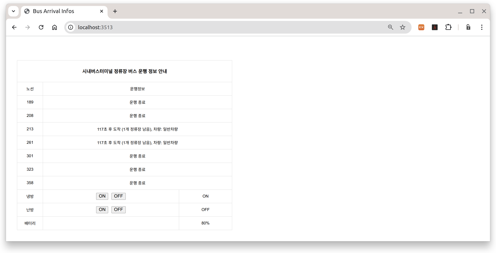

## 버스 정류장 정보 공공 API 활용법

**참조** https://senticoding.tistory.com/25

**목표** 버스 정류장 정보 공공 API를 활용한 버스도착 정보 및 및 ESS 기반 편의기능 제공 웹서버 구현

### 개발환경

**1. 운영체제** Raspbian or Ubuntu

**2. 개발언어** Node.js, HTML, Javascript


### 필요한 Open API

**1. 버스노선 조회 서비스** 국토교통부_(TAGO)_버스노선정보

**2. 정류소 조회 서비스** 국토교통부_(TAGO)_버스정류소정보

**3. 버스 도착 정보 조회 서비스** 국토교통부_(TAGO)_버스도착정보

이상 3가지 API 이용 Key 발급을 위해 공공 데이터 포털 :[ https://www.data.go.kr/](https://www.data.go.kr/)에 회원 가입한다.

회원 가입이 완료되면 가입 계정으로 로그인 후, [공공 데이터 찾기](https://www.data.go.kr/index.do)페이지에서 위 1, 2, 3에 해당하는 공공데이터를 찾아 활용 신청한다. 별다른 이유가 없다면 신청이 자동 승인되며 1일 `10,000`번의 트래픽이 제공된다. 인증키를 받고 한 시간 정도 지나야 그 인증키를 사용할 수 있다고 하니 참고하자.

**정류소 조회 서비스**에 해당하는 공공데이터는 **국토교통부_(TAGO)_버스노선정보**이다.

| 데이터명   | 국토교통부_(TAGO)_버스노선정보 상세설명 |          |          |
| :--------- | :-------------------------------------- | -------- | -------- |
| 서비스유형 | REST                                    | 심의여부 | 자동승인 |
| 신청유형   | 개발계정 \| 활용신청                    | 처리상태 | 승인     |
| 활용기간   | 2025-08-03 ~ 2027-08-03                 |          |          |


**버스노선 조회 서비스**에 해당하는 공공데이터는 **국토교통부_(TAGO)_버스정류소정보**이다.

| 데이터명   | 국토교통부_(TAGO)_버스정류소정보 상세설명 |          |          |
| :--------- | :---------------------------------------- | -------- | -------- |
| 서비스유형 | REST                                      | 심의여부 | 자동승인 |
| 신청유형   | 개발계정 \| 활용신청                      | 처리상태 | 승인     |
| 활용기간   | 2025-08-03 ~ 2027-08-03                   |          |          |


**버스 도착 정보 조회 서비스**에 해당하는 공공데이터는 **국토교통부_(TAGO)_버스도착정보**이다.


| 데이터명   | 국토교통부_(TAGO)_버스도착정보 상세설명 |          |          |
| :--------- | :-------------------------------------- | -------- | -------- |
| 서비스유형 | REST                                    | 심의여부 | 자동승인 |
| 신청유형   | 개발계정 \| 활용신청                    | 처리상태 | 승인     |
| 활용기간   | 2025-08-03 ~ 2027-08-03                 |          |          |


URL에서 사용 가능한 Encoding된 인증키

```
"your_encoded_authorization_key"
```

Encoding되지않은 원본 인증키

```
"your_decoded_authorization_key"
```


웹브라우저 URL에 다음(```getCtyCodeList```서비스를 요청하는 `request` `URL`)을 입력하고 엔터를 입력하면

```
http://apis.data.go.kr/1613000/BusRouteInfoInqireService/getCtyCodeList?serviceKey="your_encoded_authorization_key"&_type=json
```

`"your_encoded_authorization_key"`부분을 발급받은 자신의 key값으로 바꿔줘야한다.

그 응답이 웹브라우저에 다음과 같이 표시된다.

```json
"response":{"header":{"resultCode":"00","resultMsg":"NORMAL SERVICE."},"body":{"items":{"item":[{"citycode":12,"cityname":"세종특별시"},{"citycode":21,"cityname":"부산광역시"},{"citycode":22,"cityname":"대구광역시"},{"citycode":23,"cityname":"인천광역시"},{"citycode":24,"cityname":"광주광역시"},{"citycode":25,"cityname":"대전광역시\/계룡시"},{"citycode":26,"cityname":"울산광역시"},{"citycode":39,"cityname":"제주도"},{"citycode":31010,"cityname":"수원시"},{"citycode":31020,"cityname":"성남시"},{"citycode":31030,"cityname":"의정부시"},{"citycode":31040,"cityname":"안양시"},{"citycode":31050,"cityname":"부천시"},{"citycode":31060,"cityname":"광명시"},{"citycode":31070,"cityname":"평택시"},{"citycode":31080,"cityname":"동두천시"},{"citycode":31090,"cityname":"안산시"},{"citycode":31100,"cityname":"고양시"},{"citycode":31110,"cityname":"과천시"},{"citycode":31120,"cityname":"구리시"},{"citycode":31130,"cityname":"남양주시"},{"citycode":31140,"cityname":"오산시"},{"citycode":31150,"cityname":"시흥시"},{"citycode":31160,"cityname":"군포시"},{"citycode":31170,"cityname":"의왕시"},{"citycode":31180,"cityname":"하남시"},{"citycode":31190,"cityname":"용인시"},{"citycode":31200,"cityname":"파주시"},{"citycode":31210,"cityname":"이천시"},{"citycode":31220,"cityname":"안성시"},{"citycode":31230,"cityname":"김포시"},{"citycode":31240,"cityname":"화성시"},{"citycode":31250,"cityname":"광주시"},{"citycode":31260,"cityname":"양주시"},{"citycode":31270,"cityname":"포천시"},{"citycode":31320,"cityname":"여주시"},{"citycode":31350,"cityname":"연천군"},{"citycode":31370,"cityname":"가평군"},{"citycode":31380,"cityname":"양평군"},{"citycode":32010,"cityname":"춘천시"},{"citycode":32020,"cityname":"원주시\/횡성군"},{"citycode":32050,"cityname":"태백시"},{"citycode":32310,"cityname":"홍천군"},{"citycode":32360,"cityname":"철원군"},{"citycode":32410,"cityname":"양양군"},{"citycode":33010,"cityname":"청주시"},{"citycode":33020,"cityname":"충주시"},{"citycode":33030,"cityname":"제천시"},{"citycode":33320,"cityname":"보은군"},{"citycode":33330,"cityname":"옥천군"},{"citycode":33340,"cityname":"영동군"},{"citycode":33350,"cityname":"진천군"},{"citycode":33360,"cityname":"괴산군"},{"citycode":33370,"cityname":"음성군"},{"citycode":33380,"cityname":"단양군"},{"citycode":34010,"cityname":"천안시"},{"citycode":34020,"cityname":"공주시"},{"citycode":34040,"cityname":"아산시"},{"citycode":34050,"cityname":"서산시"},{"citycode":34060,"cityname":"논산시"},{"citycode":34070,"cityname":"계룡시"},{"citycode":34330,"cityname":"부여군"},{"citycode":34390,"cityname":"당진시"},{"citycode":35010,"cityname":"전주시"},{"citycode":35020,"cityname":"군산시"},{"citycode":35040,"cityname":"정읍시"},{"citycode":35050,"cityname":"남원시"},{"citycode":35060,"cityname":"김제시"},{"citycode":35320,"cityname":"진안군"},{"citycode":35330,"cityname":"무주군"},{"citycode":35340,"cityname":"장수군"},{"citycode":35350,"cityname":"임실군"},{"citycode":35360,"cityname":"순창군"},{"citycode":35370,"cityname":"고창군"},{"citycode":35380,"cityname":"부안군"},{"citycode":36010,"cityname":"목포시"},{"citycode":36020,"cityname":"여수시"},{"citycode":36030,"cityname":"순천시"},{"citycode":36040,"cityname":"나주시"},{"citycode":36060,"cityname":"광양시"},{"citycode":36320,"cityname":"곡성군"},{"citycode":36330,"cityname":"구례군"},{"citycode":36350,"cityname":"고흥군"},{"citycode":36380,"cityname":"장흥군"},{"citycode":36400,"cityname":"해남군"},{"citycode":36410,"cityname":"영암군"},{"citycode":36420,"cityname":"무안군"},{"citycode":36430,"cityname":"함평군"},{"citycode":36450,"cityname":"장성군"},{"citycode":36460,"cityname":"완도군"},{"citycode":36470,"cityname":"진도군"},{"citycode":36480,"cityname":"신안군"},{"citycode":37010,"cityname":"포항시"},{"citycode":37020,"cityname":"경주시"},{"citycode":37030,"cityname":"김천시"},{"citycode":37040,"cityname":"안동시"},{"citycode":37050,"cityname":"구미시"},{"citycode":37060,"cityname":"영주시"},{"citycode":37070,"cityname":"영천시"},{"citycode":37080,"cityname":"상주시"},{"citycode":37090,"cityname":"문경시"},{"citycode":37100,"cityname":"경산시"},{"citycode":37320,"cityname":"의성군"},{"citycode":37330,"cityname":"청송군"},{"citycode":37340,"cityname":"영양군"},{"citycode":37350,"cityname":"영덕군"},{"citycode":37360,"cityname":"청도군"},{"citycode":37370,"cityname":"고령군"},{"citycode":37380,"cityname":"성주군"},{"citycode":37390,"cityname":"칠곡군"},{"citycode":37400,"cityname":"예천군"},{"citycode":37410,"cityname":"봉화군"},{"citycode":37420,"cityname":"울진군"},{"citycode":37430,"cityname":"울릉군"},{"citycode":38010,"cityname":"창원시"},{"citycode":38030,"cityname":"진주시"},{"citycode":38050,"cityname":"통영시"},{"citycode":38060,"cityname":"사천시"},{"citycode":38070,"cityname":"김해시"},{"citycode":38080,"cityname":"밀양시"},{"citycode":38090,"cityname":"거제시"},{"citycode":38100,"cityname":"양산시"},{"citycode":38310,"cityname":"의령군"},{"citycode":38320,"cityname":"함안군"},{"citycode":38330,"cityname":"창녕군"},{"citycode":38340,"cityname":"고성군"},{"citycode":38350,"cityname":"남해군"},{"citycode":38360,"cityname":"하동군"},{"citycode":38370,"cityname":"산청군"},{"citycode":38380,"cityname":"함양군"},{"citycode":38390,"cityname":"거창군"},{"citycode":38400,"cityname":"합천군"}]}}}}
```

이 때 `service request url`의 구성은 다음과 같다.

**BASE** `http://apis.data.go.kr/1613000/BusRouteInfoInqireService/`

**Service** `getCtyCodeList?`

**Service Key** `serviceKey="encoded service key string"`

**service type** `&_type=json` `json` 또는 `xml`중 택 1

이를 Nodejs 코드로 구현한다면

```bash
mkdir ~/test_api
cd ~/test_api
gedit get_city_codes.js &
```

```javascript
const axios = require('axios');

const SERVICE_KEY = "여기에_본인_서비스키";

const url = `http://apis.data.go.kr/1613000/BusRouteInfoInqireService/getCtyCodeList?serviceKey=${SERVICE_KEY}&_type=json`;

async function getCityCodes() {
    try {
        const res = await axios.get(url, {
            headers: { Accept: 'application/json' }
        });

        const items = res.data?.response?.body?.items?.item;
        if (!items) {
            console.error("예상과 다른 응답 구조:\n", JSON.stringify(res.data, null, 2));
            return;
        }

        const cityList = Array.isArray(items) ? items : [items];
        cityList.forEach((city, idx) => {
            console.log("%d: 도시명: %s / 도시코드: %s", idx + 1, city.cityname, city.citycode);
        });
    } catch (err) {
        if (err.response) {
            console.error("응답 오류:\n", err.response.data);
        } else {
            console.error("요청 실패: %s", err.message);
        }
    }
}

getCityCodes();

```

```bash
node get_city_codes.js
```

```bash
도시명: 세종특별시 / 도시코드: 12
2: 도시명: 부산광역시 / 도시코드: 21
3: 도시명: 대구광역시 / 도시코드: 22
4: 도시명: 인천광역시 / 도시코드: 23
5: 도시명: 광주광역시 / 도시코드: 24
6: 도시명: 대전광역시/계룡시 / 도시코드: 25
7: 도시명: 울산광역시 / 도시코드: 26
8: 도시명: 제주도 / 도시코드: 39
9: 도시명: 수원시 / 도시코드: 31010
10: 도시명: 성남시 / 도시코드: 31020
11: 도시명: 의정부시 / 도시코드: 31030
12: 도시명: 안양시 / 도시코드: 31040
13: 도시명: 부천시 / 도시코드: 31050
14: 도시명: 광명시 / 도시코드: 31060
15: 도시명: 평택시 / 도시코드: 31070
16: 도시명: 동두천시 / 도시코드: 31080
17: 도시명: 안산시 / 도시코드: 31090
18: 도시명: 고양시 / 도시코드: 31100
19: 도시명: 과천시 / 도시코드: 31110
20: 도시명: 구리시 / 도시코드: 31120
21: 도시명: 남양주시 / 도시코드: 31130
22: 도시명: 오산시 / 도시코드: 31140
23: 도시명: 시흥시 / 도시코드: 31150
24: 도시명: 군포시 / 도시코드: 31160
25: 도시명: 의왕시 / 도시코드: 31170
26: 도시명: 하남시 / 도시코드: 31180
27: 도시명: 용인시 / 도시코드: 31190
28: 도시명: 파주시 / 도시코드: 31200
29: 도시명: 이천시 / 도시코드: 31210
30: 도시명: 안성시 / 도시코드: 31220
31: 도시명: 김포시 / 도시코드: 31230
32: 도시명: 화성시 / 도시코드: 31240
33: 도시명: 광주시 / 도시코드: 31250
34: 도시명: 양주시 / 도시코드: 31260
35: 도시명: 포천시 / 도시코드: 31270
36: 도시명: 여주시 / 도시코드: 31320
37: 도시명: 연천군 / 도시코드: 31350
38: 도시명: 가평군 / 도시코드: 31370
39: 도시명: 양평군 / 도시코드: 31380
40: 도시명: 춘천시 / 도시코드: 32010
41: 도시명: 원주시/횡성군 / 도시코드: 32020
42: 도시명: 태백시 / 도시코드: 32050
43: 도시명: 홍천군 / 도시코드: 32310
44: 도시명: 철원군 / 도시코드: 32360
45: 도시명: 양양군 / 도시코드: 32410
46: 도시명: 청주시 / 도시코드: 33010
47: 도시명: 충주시 / 도시코드: 33020
48: 도시명: 제천시 / 도시코드: 33030
49: 도시명: 보은군 / 도시코드: 33320
50: 도시명: 옥천군 / 도시코드: 33330
51: 도시명: 영동군 / 도시코드: 33340
52: 도시명: 진천군 / 도시코드: 33350
53: 도시명: 괴산군 / 도시코드: 33360
54: 도시명: 음성군 / 도시코드: 33370
55: 도시명: 단양군 / 도시코드: 33380
56: 도시명: 천안시 / 도시코드: 34010
57: 도시명: 공주시 / 도시코드: 34020
58: 도시명: 아산시 / 도시코드: 34040
59: 도시명: 서산시 / 도시코드: 34050
60: 도시명: 논산시 / 도시코드: 34060
61: 도시명: 계룡시 / 도시코드: 34070
62: 도시명: 부여군 / 도시코드: 34330
63: 도시명: 당진시 / 도시코드: 34390
64: 도시명: 전주시 / 도시코드: 35010
65: 도시명: 군산시 / 도시코드: 35020
66: 도시명: 정읍시 / 도시코드: 35040
67: 도시명: 남원시 / 도시코드: 35050
68: 도시명: 김제시 / 도시코드: 35060
69: 도시명: 진안군 / 도시코드: 35320
70: 도시명: 무주군 / 도시코드: 35330
71: 도시명: 장수군 / 도시코드: 35340
72: 도시명: 임실군 / 도시코드: 35350
73: 도시명: 순창군 / 도시코드: 35360
74: 도시명: 고창군 / 도시코드: 35370 # <<---------------------
75: 도시명: 부안군 / 도시코드: 35380
76: 도시명: 목포시 / 도시코드: 36010
77: 도시명: 여수시 / 도시코드: 36020
78: 도시명: 순천시 / 도시코드: 36030
79: 도시명: 나주시 / 도시코드: 36040
80: 도시명: 광양시 / 도시코드: 36060
81: 도시명: 곡성군 / 도시코드: 36320
82: 도시명: 구례군 / 도시코드: 36330
83: 도시명: 고흥군 / 도시코드: 36350
84: 도시명: 장흥군 / 도시코드: 36380
85: 도시명: 해남군 / 도시코드: 36400
86: 도시명: 영암군 / 도시코드: 36410
87: 도시명: 무안군 / 도시코드: 36420
88: 도시명: 함평군 / 도시코드: 36430
89: 도시명: 장성군 / 도시코드: 36450
90: 도시명: 완도군 / 도시코드: 36460
91: 도시명: 진도군 / 도시코드: 36470
92: 도시명: 신안군 / 도시코드: 36480
93: 도시명: 포항시 / 도시코드: 37010
94: 도시명: 경주시 / 도시코드: 37020
95: 도시명: 김천시 / 도시코드: 37030
96: 도시명: 안동시 / 도시코드: 37040
97: 도시명: 구미시 / 도시코드: 37050
98: 도시명: 영주시 / 도시코드: 37060
99: 도시명: 영천시 / 도시코드: 37070
100: 도시명: 상주시 / 도시코드: 37080
101: 도시명: 문경시 / 도시코드: 37090
102: 도시명: 경산시 / 도시코드: 37100
103: 도시명: 의성군 / 도시코드: 37320
104: 도시명: 청송군 / 도시코드: 37330
105: 도시명: 영양군 / 도시코드: 37340
106: 도시명: 영덕군 / 도시코드: 37350
107: 도시명: 청도군 / 도시코드: 37360
108: 도시명: 고령군 / 도시코드: 37370
109: 도시명: 성주군 / 도시코드: 37380
110: 도시명: 칠곡군 / 도시코드: 37390
111: 도시명: 예천군 / 도시코드: 37400
112: 도시명: 봉화군 / 도시코드: 37410
113: 도시명: 울진군 / 도시코드: 37420
114: 도시명: 울릉군 / 도시코드: 37430
115: 도시명: 창원시 / 도시코드: 38010
116: 도시명: 진주시 / 도시코드: 38030
117: 도시명: 통영시 / 도시코드: 38050
118: 도시명: 사천시 / 도시코드: 38060
119: 도시명: 김해시 / 도시코드: 38070
120: 도시명: 밀양시 / 도시코드: 38080
121: 도시명: 거제시 / 도시코드: 38090
122: 도시명: 양산시 / 도시코드: 38100
123: 도시명: 의령군 / 도시코드: 38310
124: 도시명: 함안군 / 도시코드: 38320
125: 도시명: 창녕군 / 도시코드: 38330
126: 도시명: 고성군 / 도시코드: 38340
127: 도시명: 남해군 / 도시코드: 38350
128: 도시명: 하동군 / 도시코드: 38360
129: 도시명: 산청군 / 도시코드: 38370
130: 도시명: 함양군 / 도시코드: 38380
131: 도시명: 거창군 / 도시코드: 38390
132: 도시명: 합천군 / 도시코드: 38400
```


구글 지도를 이용한 GPS좌표 수집

[**강호항공고등학교**](https://maps.app.goo.gl/qSuAx92yoTGdTf3M8) **위도**35.425188, **경도**126.700381

[**고창중학교**](https://maps.app.goo.gl/HwLgVMgoqFn1cJKM8) **위도**35.428715, **경도**126.697370

[**고창문화터미널**](https://maps.app.goo.gl/W8C48bUX85FKenLw9) **위도**35.435821, **경도**126.695993


GPS좌표를 중심으로 반경 1(Km) 이내의 정류장 검색 코드 `get_station_id_by_gps.js`작성

```bash
cd ~/test_api
gedit get_station_id_by_gps.js	
```

```javascript
const axios = require('axios');

const SERVICE_KEY = "여기에_본인_서비스키";

// 기준 좌표 (강호항공고등학교 )
const LAT = 35.428588;
const LNG = 126.693797;
const RADIUS = 500; // 반경 (m)

// 거리 계산 함수 (Haversine)
function haversine(lat1, lon1, lat2, lon2) {
  const R = 6371000; // 지구 반지름 (m)
  const toRad = deg => deg * Math.PI / 180;

  const dLat = toRad(lat2 - lat1);
  const dLon = toRad(lon2 - lon1);

  const a = Math.sin(dLat / 2) ** 2 +
            Math.cos(toRad(lat1)) * Math.cos(toRad(lat2)) *
            Math.sin(dLon / 2) ** 2;

  const c = 2 * Math.atan2(Math.sqrt(a), Math.sqrt(1 - a));
  return Math.round(R * c);
}

async function fetchNearbyStations() {
  const url = `https://apis.data.go.kr/1613000/BusSttnInfoInqireService/getCrdntPrxmtSttnList` +
              `?serviceKey=${SERVICE_KEY}&gpsLati=${LAT}&gpsLong=${LNG}&radius=5000&_type=json`;

  try {
    const response = await axios.get(url);
    const items = response.data?.response?.body?.items?.item;

    if (!items || (Array.isArray(items) && items.length === 0)) {
      console.log("반경 내 정류장이 없습니다.");
      return;
    }

    const stations = Array.isArray(items) ? items : [items];

    // 거리 직접 계산 후 주어진반경 RADIUS값 이내만 필터링
    const filtered = stations.map(stn => {
      const dist = haversine(LAT, LNG, parseFloat(stn.gpslati), parseFloat(stn.gpslong));
      return { ...stn, dist };
    }).filter(stn => stn.dist <= RADIUS);

    if (filtered.length === 0) {
      console.log("반경 %d m 이내에 정류장이 없습니다.", RADIUS);
      return;
    }

    console.log("반경 %d m 내 정류장 목록 (거리 직접 계산):", RADIUS);
    filtered.forEach((stn, i) => {
      console.log("======== 정류장 %d ========", i + 1);
      console.log("정류장명: %s", stn.nodenm);
      console.log("정류장 ID: %s", stn.nodeid);
      console.log("거리: %d m", stn.dist);
      console.log("위도: %s", stn.gpslati);
      console.log("경도: %s", stn.gpslong);
      console.log("");
    });

  } catch (err) {
    console.error("API 호출 실패: %s", err.message);
  }
}

fetchNearbyStations();


```

위 코드는 강호항공고등학교의 GPS 좌표를 중심으로 반경 500(m)이내의 정류장을 검색하도록 한 코드이다.

해당 코드를 다음과 같이 실행하여

고창중, 보건소, 시내버스터미널 정류장 등의 정류장 ID를 알아낼 수 있다.

```bash
node get_station_id_by_gps.js
반경 500 m 내 정류장 목록 (거리 직접 계산):
======== 정류장 1 ========
정류장명: 고창중
정류장 ID: TSB318000118
거리: 83 m
위도: 35.428122
경도: 126.6945181

======== 정류장 2 ========
정류장명: 보건소
정류장 ID: TSB318000119
거리: 299 m
위도: 35.427114
경도: 126.696551

======== 정류장 3 ========
정류장명: 시내버스터미널
정류장 ID: TSB318001052
거리: 369 m
위도: 35.431524
경도: 126.6957011

======== 정류장 4 ========
정류장명: 시내버스터미널
정류장 ID: TSB318000513
거리: 375 m
위도: 35.431737
경도: 126.6952871

======== 정류장 5 ========
정류장명: 백양
정류장 ID: TSB318000259
거리: 423 m
위도: 35.42479
경도: 126.6935828

======== 정류장 6 ========
정류장명: 백양
정류장 ID: TSB318000260
거리: 434 m
위도: 35.424687
경도: 126.6937672
```

위 결과 중 강호항공고에서 가까운 순서로 다음 3 정류장에 대한 버스도착 정보를 제공하는 웹페이지를 구현해 보자.

| 정류장명       | 정류장ID     | 거리(m) |
| -------------- | ------------ | ------- |
| 고창중         | TSB318000118 | 83      |
| 보건소         | TSB318000119 | 299     |
| 시내버스터미널 | TSB318000513 | 369     |

**고창중** 정류장을 지나는 모든 노선을 조회하는 `get_routes_at_station.js`를 다음과 같이 작성한다.

```javascript
const axios = require('axios');

const SERVICE_KEY = "여기에_본인_서비스키";
const CITY_CODE = "35370";  // 고창군
const NODE_ID = "TSB318000118";  // 조회 대상 정류소 ID

async function fetchRoutesAtStation() {
  const url = "https://apis.data.go.kr/1613000/BusSttnInfoInqireService/getSttnThrghRouteList" +
              "?serviceKey=" + SERVICE_KEY +
              "&cityCode=" + CITY_CODE +
              "&nodeid=" + NODE_ID +
              "&_type=json" +
              "&numOfRows=100&pageNo=1";

  try {
    const response = await axios.get(url);
    const items = response.data?.response?.body?.items?.item;

    if (!items) {
      console.log("정류장을 경유하는 노선이 없습니다.");
      return;
    }

    const routes = Array.isArray(items) ? items : [items];
    const stationName = routes[0].nodenm || "알 수 없음";

    console.log("정류장 ID: %s (%s)", NODE_ID, stationName);
    console.log("총 경유 노선 수: %d\n", routes.length);

    routes.forEach((route, idx) => {
      console.log("[%d] 노선번호: %s", idx + 1, route.routeno);
    });

  } catch (err) {
    console.error("API 호출 오류: %s", err.message);
    if (err.response) {
      console.error("응답 코드: %d", err.response.status);
      console.error("응답 본문:\n%s", err.response.data);
    }
  }
}

fetchRoutesAtStation();

```

위 코드의 실행 결과는 다음과 같다.

```bash
node get_routes_at_station.js 
정류장 ID: TSB318000118 (알 수 없음)
총 경유 노선 수: 45

[1] 노선번호: 213
[2] 노선번호: 323
[3] 노선번호: 302
[4] 노선번호: 354
[5] 노선번호: 213-1
[6] 노선번호: 211
[7] 노선번호: 301
[8] 노선번호: 322
[9] 노선번호: 213
[10] 노선번호: 301
[11] 노선번호: 203
[12] 노선번호: 206-1
[13] 노선번호: 206
[14] 노선번호: 305
[15] 노선번호: 261
[16] 노선번호: 321
[17] 노선번호: 201
[18] 노선번호: 213
[19] 노선번호: 207
[20] 노선번호: 301
[21] 노선번호: 207
[22] 노선번호: 202
[23] 노선번호: 357
[24] 노선번호: 302
[25] 노선번호: 201
[26] 노선번호: 302-1
[27] 노선번호: 189
[28] 노선번호: 213
[29] 노선번호: 358
[30] 노선번호: 208
[31] 노선번호: 302
[32] 노선번호: 213
[33] 노선번호: 208
[34] 노선번호: 261-1
[35] 노선번호: 204
[36] 노선번호: 203
[37] 노선번호: 303
[38] 노선번호: 263
[39] 노선번호: 205
[40] 노선번호: 206
[41] 노선번호: 263
[42] 노선번호: 358
[43] 노선번호: 203
[44] 노선번호: 353
[45] 노선번호: 323
```

위 코드의 `const NODE_ID = "TSB318000118";`부분을 보건소 정류장의 정류장ID로 변경하여 실행하면

```bash
정류장 ID: TSB318000119 (알 수 없음)
총 경유 노선 수: 36

[1] 노선번호: 323
[2] 노선번호: 302
[3] 노선번호: 212
[4] 노선번호: 211
[5] 노선번호: 301
[6] 노선번호: 322
[7] 노선번호: 203
[8] 노선번호: 301
[9] 노선번호: 213
[10] 노선번호: 206
[11] 노선번호: 305
[12] 노선번호: 213
[13] 노선번호: 261
[14] 노선번호: 321
[15] 노선번호: 213
[16] 노선번호: 301
[17] 노선번호: 357
[18] 노선번호: 213
[19] 노선번호: 302
[20] 노선번호: 201
[21] 노선번호: 213
[22] 노선번호: 302-1
[23] 노선번호: 206
[24] 노선번호: 189
[25] 노선번호: 358
[26] 노선번호: 208
[27] 노선번호: 302
[28] 노선번호: 261-1
[29] 노선번호: 203
[30] 노선번호: 303
[31] 노선번호: 263
[32] 노선번호: 205
[33] 노선번호: 212
[34] 노선번호: 263
[35] 노선번호: 358
[36] 노선번호: 323
```

다시 `const NODE_ID = "TSB318000118";`부분을 시내버스터미널 정류장의 정류장ID로 변경하여 실행하면

```bash
정류장 ID: TSB318000513 (알 수 없음)
총 경유 노선 수: 46

[1] 노선번호: 213
[2] 노선번호: 323
[3] 노선번호: 302
[4] 노선번호: 213-1
[5] 노선번호: 211
[6] 노선번호: 301
[7] 노선번호: 102
[8] 노선번호: 322
[9] 노선번호: 213
[10] 노선번호: 301
[11] 노선번호: 203
[12] 노선번호: 206-1
[13] 노선번호: 206
[14] 노선번호: 305
[15] 노선번호: 261
[16] 노선번호: 321
[17] 노선번호: 201
[18] 노선번호: 213
[19] 노선번호: 207
[20] 노선번호: 301
[21] 노선번호: 101
[22] 노선번호: 207
[23] 노선번호: 202
[24] 노선번호: 357
[25] 노선번호: 302
[26] 노선번호: 201
[27] 노선번호: 302-1
[28] 노선번호: 189
[29] 노선번호: 213
[30] 노선번호: 358
[31] 노선번호: 208
[32] 노선번호: 302
[33] 노선번호: 213
[34] 노선번호: 208
[35] 노선번호: 261-1
[36] 노선번호: 204
[37] 노선번호: 203
[38] 노선번호: 303
[39] 노선번호: 263
[40] 노선번호: 205
[41] 노선번호: 206
[42] 노선번호: 263
[43] 노선번호: 358
[44] 노선번호: 203
[45] 노선번호: 353
[46] 노선번호: 323
```

위 노선 검색 결과를 바탕으로 3 정류장을 모두 경유하는 노선을 임의로 몇 개 선택한다.

`189`, `208` `213`, `261`, `301` `323`, `358`


위 노선 들의 고창중 정류장 도착 정보를 출력하는코드 `get_arrival_infos_at_station.js`를 다음과 같이 작성한다.

```javascript
const axios = require('axios');

const SERVICE_KEY = "여기에_본인_서비스키";
const CITY_CODE = "35370";
const NODE_ID = "TSB318000118"; // 고창중 정류장
const TARGET_ROUTE_NOS = ["189", "213", "261", "301", "323", "358"];

// 현재 HHMM 시간 반환
function getCurrentTimeHHMM() {
  const now = new Date();
  const hh = String(now.getHours()).padStart(2, '0');
  const mm = String(now.getMinutes()).padStart(2, '0');
  return parseInt(hh + mm, 10);
}

// 정류장을 경유하는 전체 노선 목록 조회
async function fetchRoutesAtStation() {
  const url = `https://apis.data.go.kr/1613000/BusSttnInfoInqireService/getSttnThrghRouteList` +
              `?serviceKey=${SERVICE_KEY}&cityCode=${CITY_CODE}&nodeid=${NODE_ID}` +
              `&_type=json&numOfRows=100&pageNo=1`;

  const response = await axios.get(url);
  const items = response.data?.response?.body?.items?.item;
  if (!items) return [];
  return Array.isArray(items) ? items : [items];
}

// 노선별 첫차, 막차 시간 조회
async function fetchRouteInfo(routeId) {
  const url = `https://apis.data.go.kr/1613000/BusRouteInfoInqireService/getRouteInfoIem` +
              `?serviceKey=${SERVICE_KEY}&cityCode=${CITY_CODE}&routeId=${routeId}&_type=json`;

  const response = await axios.get(url);
  return response.data?.response?.body?.items?.item || null;
}

// 도착정보 조회
async function fetchArrivalInfo(routeId) {
  const url = `https://apis.data.go.kr/1613000/ArvlInfoInqireService/getSttnAcctoArvlPrearngeInfoList` +
              `?serviceKey=${SERVICE_KEY}&cityCode=${CITY_CODE}&nodeId=${NODE_ID}&routeId=${routeId}&_type=json`;

  const response = await axios.get(url);
  const items = response.data?.response?.body?.items?.item;
  if (!items) return [];
  return Array.isArray(items) ? items : [items];
}

// 실행 메인
async function main() {
  try {
    const nowHHMM = getCurrentTimeHHMM();
    const routes = await fetchRoutesAtStation();
    const targetRoutes = routes.filter(r => TARGET_ROUTE_NOS.includes(String(r.routeno)));

    if (targetRoutes.length === 0) {
      console.log("대상 노선이 해당 정류장을 경유하지 않습니다.");
      return;
    }

    for (const route of targetRoutes) {
      const routeNo = String(route.routeno);
      const routeId = route.routeid;
      const routeInfo = await fetchRouteInfo(routeId);

      if (!routeInfo) {
        console.log("노선 %s (%s): 상세정보 조회 실패", routeNo, routeId);
        continue;
      }

      const first = parseInt(routeInfo.startvehicletime || "0000", 10);
      const last = parseInt(routeInfo.endvehicletime || "0000", 10);
      const isRunning = nowHHMM >= first && nowHHMM <= last;

      console.log("노선번호: %s", routeNo);
      console.log("- 첫차시간: %s", String(first).padStart(4, '0'));
      console.log("- 막차시간: %s", String(last).padStart(4, '0'));
      console.log("- 현재시각: %s", String(nowHHMM).padStart(4, '0'));
      console.log("- 운행상태: %s", isRunning ? "운행 중" : "운행 종료");

      if (isRunning) {
        const arrivals = await fetchArrivalInfo(routeId);
        if (arrivals.length === 0) {
          console.log("  도착 정보 없음");
        } else {
          arrivals.forEach((info, idx) => {
            console.log("  [%d] %d초 후 도착 (%d개 정류장 남음), 차량: %s",
              idx + 1,
              info.arrtime,
              info.arrprevstationcnt,
              info.vehicletp || "정보 없음"
            );
          });
        }
      }

      console.log("--------------------------------------------------");
      await new Promise(resolve => setTimeout(resolve, 300)); // API 과호출 방지
    }

  } catch (err) {
    console.error("오류 발생: %s", err.message);
    if (err.response) {
      console.error("응답코드: %d", err.response.status);
      console.error("본문:\n%s", err.response.data);
    }
  }
}

main();

```

위 코드의 실행 결과는 다음과 같다.

```bash
node get_arrival_infos_at_station.js 
노선번호: 213
- 첫차시간: 0635
- 막차시간: 1920
- 현재시각: 1107
- 운행상태: 운행 중
  [1] 55초 후 도착 (1개 정류장 남음), 차량: 일반차량
--------------------------------------------------
노선번호: 323
- 첫차시간: 0915
- 막차시간: 0915
- 현재시각: 1107
- 운행상태: 운행 종료
--------------------------------------------------
노선번호: 301
- 첫차시간: 1920
- 막차시간: 1920
- 현재시각: 1107
- 운행상태: 운행 종료
--------------------------------------------------
노선번호: 213
- 첫차시간: 0740
- 막차시간: 0740
- 현재시각: 1107
- 운행상태: 운행 종료
--------------------------------------------------
노선번호: 301
- 첫차시간: 0810
- 막차시간: 0810
- 현재시각: 1107
- 운행상태: 운행 종료
--------------------------------------------------
노선번호: 213
- 첫차시간: 1000
- 막차시간: 1000
- 현재시각: 1107
- 운행상태: 운행 종료
--------------------------------------------------
노선번호: 301
- 첫차시간: 0655
- 막차시간: 0655
- 현재시각: 1107
- 운행상태: 운행 종료
--------------------------------------------------
노선번호: 189
- 첫차시간: 0000
- 막차시간: 0000
- 현재시각: 1107
- 운행상태: 운행 종료
--------------------------------------------------
노선번호: 213
- 첫차시간: 2040
- 막차시간: 2040
- 현재시각: 1107
- 운행상태: 운행 종료
--------------------------------------------------
노선번호: 358
- 첫차시간: 1910
- 막차시간: 1910
- 현재시각: 1107
- 운행상태: 운행 종료
--------------------------------------------------
노선번호: 213
- 첫차시간: 0650
- 막차시간: 0650
- 현재시각: 1107
- 운행상태: 운행 종료
--------------------------------------------------
노선번호: 261
- 첫차시간: 0710
- 막차시간: 1420
- 현재시각: 1107
- 운행상태: 운행 중
  [1] 55초 후 도착 (1개 정류장 남음), 차량: 일반차량
--------------------------------------------------
노선번호: 358
- 첫차시간: 1340
- 막차시간: 1340
- 현재시각: 1107
- 운행상태: 운행 종료
--------------------------------------------------
노선번호: 323
- 첫차시간: 1635
- 막차시간: 1635
- 현재시각: 1107
- 운행상태: 운행 종료
--------------------------------------------------
```

이 코드 구조 상 버스 도착 정보 조회 API는 10초 마다 1회 호출하므로, 1분에 6회, 1시간에 36회, 1일에는 864회 호출하므로 10000회/1일 에는 미치지 못하지만, 버스 경로 정보 조회 API는 7개 노선에 대해 조회하므로 10초 마다 7회 호출하므로, 1분에 42회, 1시간에 2,520회 호출되므로 4시간만 지나면 10,080회가 호출되므로 1일 제공 트레픽 10,000회를 초과해버린다. 이를 개선하기 위해 노선정보를 하루 1회만 조회하여 JSON 파일로 저장 하여 날짜가 바뀌기 전까지는 저장된 경로를 이용하는 구조로 변경하여 1일 제공 트레픽을 초과하지 않도록 개선할 필요가 있다. 다음은 개선 사항이 반영된 `get_arrival_infos2.js`


```javascript
const axios = require('axios');
const fs = require('fs');
const path = require('path');

const SERVICE_KEY = "여기에_본인_서비스키";
const CITY_CODE = "35370";
const NODE_ID = "TSB318000513";
const RAW_TARGET_ROUTE_NOS = ["189", "213", "261", "301", "323", "358"];
const CACHE_FILE = "route_info_cache.json";

// 숫자만 추출
function normalizeRouteNo(no) {
  return String(no).replace(/[^0-9]/g, '');
}
const TARGET_ROUTE_NOS = RAW_TARGET_ROUTE_NOS.map(normalizeRouteNo);

// HHMM 형식 시간 반환
function getCurrentTimeHHMM() {
  const now = new Date();
  return parseInt(now.getHours().toString().padStart(2, '0') + now.getMinutes().toString().padStart(2, '0'), 10);
}

// YYYY-MM-DD 반환
function getTodayDate() {
  const now = new Date();
  return now.toISOString().slice(0, 10);
}

// 정류장을 경유하는 노선 조회
async function fetchRoutesAtStation() {
  const url = `https://apis.data.go.kr/1613000/BusSttnInfoInqireService/getSttnThrghRouteList?serviceKey=${SERVICE_KEY}&cityCode=${CITY_CODE}&nodeid=${NODE_ID}&_type=json&numOfRows=100&pageNo=1`;
  const res = await axios.get(url);
  const items = res.data?.response?.body?.items?.item;
  return Array.isArray(items) ? items : [items];
}

// 노선 상세정보 API 호출
async function fetchRouteInfo(routeId) {
  const url = `https://apis.data.go.kr/1613000/BusRouteInfoInqireService/getRouteInfoIem?serviceKey=${SERVICE_KEY}&cityCode=${CITY_CODE}&routeId=${routeId}&_type=json`;
  const res = await axios.get(url);
  return res.data?.response?.body?.items?.item || null;
}

// 도착 정보
async function fetchArrivalInfo(routeId) {
  const url = `https://apis.data.go.kr/1613000/ArvlInfoInqireService/getSttnAcctoArvlPrearngeInfoList?serviceKey=${SERVICE_KEY}&cityCode=${CITY_CODE}&nodeId=${NODE_ID}&routeId=${routeId}&_type=json`;
  const res = await axios.get(url);
  const items = res.data?.response?.body?.items?.item;
  return Array.isArray(items) ? items : [items];
}

// 캐시 로딩
function loadRouteInfoCache() {
  try {
    const json = fs.readFileSync(CACHE_FILE, 'utf8');
    const data = JSON.parse(json);
    if (data.date !== getTodayDate()) {
      console.log("캐시 만료됨 → 새로 로딩 예정");
      return { date: getTodayDate(), data: {} };
    }
    return data;
  } catch (e) {
    console.log("캐시 파일 없음 또는 손상 → 새로 생성 예정");
    return { date: getTodayDate(), data: {} };
  }
}

// 캐시 저장
function saveRouteInfoCache(cache) {
  try {
    fs.writeFileSync(CACHE_FILE, JSON.stringify(cache, null, 2), 'utf8');
  } catch (e) {
    console.error("캐시 저장 실패:", e.message);
  }
}

// 캐시에서 routeInfo 조회 또는 API 호출
async function getCachedRouteInfo(routeId, cache) {
  if (cache.data[routeId]) return cache.data[routeId];
  const info = await fetchRouteInfo(routeId);
  if (info) {
    cache.data[routeId] = info;
    saveRouteInfoCache(cache);
  }
  return info;
}

// 메인 실행
async function main() {
  try {
    const nowHHMM = getCurrentTimeHHMM();
    const routeInfoCache = loadRouteInfoCache();
    const stationRoutes = await fetchRoutesAtStation();

    const checked = new Set();

    for (const r of stationRoutes) {
      const rawNo = r.routeno;
      const normNo = normalizeRouteNo(rawNo);
      const routeId = r.routeid;

      if (!TARGET_ROUTE_NOS.includes(normNo)) continue;
      if (checked.has(normNo)) continue;
      checked.add(normNo);

      const routeInfo = await getCachedRouteInfo(routeId, routeInfoCache);
      if (!routeInfo) {
        console.log("노선 %s (%s): 상세정보 조회 실패", rawNo, routeId);
        continue;
      }

      const first = parseInt(routeInfo.startvehicletime || "0000", 10);
      const last = parseInt(routeInfo.endvehicletime || "0000", 10);
      const isRunning = nowHHMM >= first && nowHHMM <= last;

      console.log("노선번호: %s", rawNo);
      console.log("- 첫차시간: %s", String(first).padStart(4, '0'));
      console.log("- 막차시간: %s", String(last).padStart(4, '0'));
      console.log("- 현재시각: %s", String(nowHHMM).padStart(4, '0'));
      console.log("- 운행상태: %s", isRunning ? "운행 중" : "운행 종료");

      if (isRunning) {
        const arrivals = await fetchArrivalInfo(routeId);
        if (arrivals.length === 0) {
          console.log("  도착 정보 없음");
        } else {
          arrivals.forEach((info, idx) => {
            console.log("  [%d] %d초 후 도착 (%d개 정류장 남음), 차량: %s",
              idx + 1,
              info.arrtime,
              info.arrprevstationcnt,
              info.vehicletp || "정보 없음"
            );
          });
        }
      }

      console.log("--------------------------------------------------");
      await new Promise(resolve => setTimeout(resolve, 300));
    }

  } catch (err) {
    console.error("오류 발생: %s", err.message);
    if (err.response) {
      console.error("응답코드: %d", err.response.status);
      console.error("본문:\n%s", err.response.data);
    }
  }
}

main();

```

이 코드는 1일 1회 버스경로조회 API를 호출 하여 `route_info_cache.json`파일을 생성하고, 날짜가 바뀔 때까지 버스 경로를 해당 파일에서 읽어 사용하므로 API 하루 호출 회 수 제한내에서 운영할 수 있다.

`const NODE_ID = "TSB318000118";`부분의 정류장 ID부분만 보건소, 시내버스터미널의 ID로 변경하여 사용할 수 있다.

이 코드를 기반으로 고창중 정류장 버스도착정보 웹서버, 보건소 정류장 버스도착정보 웹서버, 시내버스터미널 정류장 버스도착정보 웹서버를 각각 구현하는데, 각 정류장ID를 참조하여 다음 표를 참조하여 서버를 구현하기로 한다.


| 정류장            | 정류장ID     | 웹앱(폴더)명 |
| ----------------- | ------------ | ------------ |
| 1. 고창중         | TSB318000118 | bus118       |
| 2. 보건소         | TSB318000119 | bus119       |
| 3. 시내버스터미널 | TSB318000513 | bus513       |

### 1. 고창중(bus118)

`express`를 이용하여 웹 어플리케이션 `bus118` 작성

```
express bus_info118
```

웹 어플리케이션 `bus_info118` 폴더로 작업경로 변경

```
cd bus118
```

 웹 어플리케이션 `bus_info118` 어플의 웹게시를 위한 기본 의존성 설치

```
npm i
```


 웹 어플리케이션 `bus_info118` 어플의 추가 의존성 설치

```
npm i axios socket.io serialport
```

**`app.js`수정 편집**

```
gedit app.js &
```

```javascript
const axios = require('axios');
const express = require('express');
const http = require('http');
const socketIO = require('socket.io');
const fs = require('fs');

const app = express();
const server = http.createServer(app);
const io = socketIO(server);

app.use(express.static(__dirname + '/public'));

const PORT = 3118;

const SERVICE_KEY = "여기에_본인_서비스키";
const CITY_CODE = "35370";  // 고창군
const NODE_ID = "TSB318000118"; // 고창중
const TARGET_ROUTE_NOS = ["189", "208", "213", "261", "301", "323", "358"];
const CACHE_FILE = "route_info_cache.json";

// 현재 HHMM
function getCurrentTimeHHMM() {
  const now = new Date();
  return parseInt(now.getHours().toString().padStart(2, '0') + now.getMinutes().toString().padStart(2, '0'), 10);
}

// 오늘 날짜
function getTodayDate() {
  return new Date().toISOString().slice(0, 10);
}

// 캐시 로딩
function loadRouteInfoCache() {
  try {
    const json = fs.readFileSync(CACHE_FILE, 'utf8');
    const data = JSON.parse(json);
    if (data.date !== getTodayDate()) {
      console.log("캐시 만료됨 → 새로 로딩 예정");
      return { date: getTodayDate(), data: {} };
    }
    return data;
  } catch (e) {
    console.log("캐시 없음 또는 손상 → 새로 생성 예정");
    return { date: getTodayDate(), data: {} };
  }
}

// 캐시 저장
function saveRouteInfoCache(cache) {
  try {
    fs.writeFileSync(CACHE_FILE, JSON.stringify(cache, null, 2), 'utf8');
  } catch (e) {
    console.error("캐시 저장 실패:", e.message);
  }
}

// 정류장을 경유하는 노선 조회
async function fetchRoutesAtStation() {
  const url = `https://apis.data.go.kr/1613000/BusSttnInfoInqireService/getSttnThrghRouteList` +
              `?serviceKey=${SERVICE_KEY}&cityCode=${CITY_CODE}&nodeid=${NODE_ID}` +
              `&_type=json&numOfRows=100&pageNo=1`;
  const response = await axios.get(url);
  const items = response.data?.response?.body?.items?.item;
  return Array.isArray(items) ? items : [items];
}

// 노선 상세정보 조회 (API 호출)
async function fetchRouteInfo(routeId) {
  const url = `https://apis.data.go.kr/1613000/BusRouteInfoInqireService/getRouteInfoIem` +
              `?serviceKey=${SERVICE_KEY}&cityCode=${CITY_CODE}&routeId=${routeId}&_type=json`;
  const response = await axios.get(url);
  return response.data?.response?.body?.items?.item || null;
}

// 캐시된 routeInfo 조회
async function getCachedRouteInfo(routeId, cache) {
  if (cache.data[routeId]) return cache.data[routeId];
  const info = await fetchRouteInfo(routeId);
  if (info) {
    cache.data[routeId] = info;
    saveRouteInfoCache(cache);
  }
  return info;
}

// 도착정보 조회
async function fetchArrivalInfo(routeId) {
  const url = `https://apis.data.go.kr/1613000/ArvlInfoInqireService/getSttnAcctoArvlPrearngeInfoList` +
              `?serviceKey=${SERVICE_KEY}&cityCode=${CITY_CODE}&nodeId=${NODE_ID}&routeId=${routeId}&_type=json`;
  const response = await axios.get(url);
  const items = response.data?.response?.body?.items?.item;
  return Array.isArray(items) ? items : [items];
}

// 메인 처리 함수
async function updateBusInfos() {
  try {
    const nowHHMM = getCurrentTimeHHMM();
    const routes = await fetchRoutesAtStation();
    const cache = loadRouteInfoCache();

    const targetRoutes = routes.filter(r => TARGET_ROUTE_NOS.includes(String(r.routeno)));

    for (const routeNo of TARGET_ROUTE_NOS) {
      const route = targetRoutes.find(r => String(r.routeno) === routeNo);

      if (!route) {
        const msg = "해당 노선이 이 정류장을 경유하지 않음";
        console.log("[%s] %s", routeNo, msg);
        io.emit(routeNo, msg);
        continue;
      }

      const routeId = route.routeid;
      const routeInfo = await getCachedRouteInfo(routeId, cache);

      if (!routeInfo) {
        const msg = "상세 정보 조회 실패";
        console.log("[%s] %s", routeNo, msg);
        io.emit(routeNo, msg);
        continue;
      }

      const first = parseInt(routeInfo.startvehicletime || "0000", 10);
      const last = parseInt(routeInfo.endvehicletime || "0000", 10);
      const isRunning = nowHHMM >= first && nowHHMM <= last;

      if (!isRunning) {
        const msg = "운행 종료";
        console.log("[%s] %s", routeNo, msg);
        io.emit(routeNo, msg);
        continue;
      }

      const arrivals = await fetchArrivalInfo(routeId);
      if (arrivals.length === 0) {
        const msg = "도착 정보 없음";
        console.log("[%s] %s", routeNo, msg);
        io.emit(routeNo, msg);
      } else {
        const info = arrivals[0];
        const msg = `${info.arrtime}초 후 도착 (${info.arrprevstationcnt}개 정류장 남음), 차량: ${info.vehicletp || "정보 없음"}`;
        console.log("[%s] %s", routeNo, msg);
        io.emit(routeNo, msg);
      }

      await new Promise(res => setTimeout(res, 300));
    }
  } catch (err) {
    console.error("오류 발생: %s", err.message);
  }
}

setInterval(updateBusInfos, 10000); // 10초마다 갱신

server.listen(PORT, () => {
  console.log('listening on *:' + PORT);
});


```


**`index.html`작성**

```
gedit ./public/index.html &
```

```html
<!DOCTYPE html>
<html lang="ko">
<head>
  <meta charset="UTF-8">
  <title>Bus Arrival Infos</title>
  <style>
    body {
      padding: 25px;
      font: 12px "Lucida Grande", Helvetica, Arial, sans-serif;
    }
    #canvas {
      border: 1px solid lightgrey;
    }
    table {
      border: 1px solid lightgrey;
      border-collapse: collapse;
    }
    td {
      border: 1px solid lightgrey;
      padding: 8px;
    }
    #title {
      font-weight: bold;
      font-size: 48px;
      color: #777;
    }
    a {
      color: #00B7FF;
    }
  </style>
</head>

<body>
  <p>&nbsp;</p>
  <table width="640" height="480">
    <tr align="center" height="40">
      <td colspan="5"><h3>고창중 정류장 버스 운행 정보 안내</h3></td>
    </tr>
    <tr align="center" height="40">
      <td width="60">노선</td><td colspan="4">운행정보</td>
    </tr>
    <tr align="center" height="40"><td>189</td><td colspan="4" id="189">&nbsp;</td></tr>
    <tr align="center" height="40"><td>208</td><td colspan="4" id="208">&nbsp;</td></tr>
    <tr align="center" height="40"><td>213</td><td colspan="4" id="213">&nbsp;</td></tr>
    <tr align="center" height="40"><td>261</td><td colspan="4" id="261">&nbsp;</td></tr>
    <tr align="center" height="40"><td>301</td><td colspan="4" id="301">&nbsp;</td></tr>
    <tr align="center" height="40"><td>323</td><td colspan="4" id="323">&nbsp;</td></tr>
    <tr align="center" height="40"><td>358</td><td colspan="4" id="358">&nbsp;</td></tr>

    <tr align="center" height="40">
      <td>냉방</td>
      <td colspan="3">
        <input type="button" value="ON" onclick="turn_on_cooler()"> &nbsp; 
        <input type="button" value="OFF" onclick="turn_off_cooler()">
      </td>
      <td id="cool">&nbsp;</td>
    </tr>
    <tr align="center" height="40">
      <td>난방</td>
      <td colspan="3">
        <input type="button" value="ON" onclick="turn_on_heater()"> &nbsp; 
        <input type="button" value="OFF" onclick="turn_off_heater()">
      </td>
      <td id="heat">&nbsp;</td>
    </tr>
    <tr align="center" height="40">
      <td>배터리</td><td colspan="3">&nbsp;</td>
      <td>&nbsp;</td>
    </tr>
  </table>

  <script src="/socket.io/socket.io.js"></script>
  <script src="https://code.jquery.com/jquery-3.6.0.min.js"></script>
  <script>
    $(function () {
      var socket = io();
      socket.on('189', function (info) { $('#189').text(info); });
      socket.on('208', function (info) { $('#208').text(info); });
      socket.on('213', function (info) { $('#213').text(info); });
      socket.on('261', function (info) { $('#261').text(info); });
      socket.on('301', function (info) { $('#301').text(info); });
      socket.on('323', function (info) { $('#323').text(info); });
      socket.on('358', function (info) { $('#358').text(info); });
    });

    function turn_on_cooler(){
      $('#cool').text("ON");
    }
    function turn_off_cooler(){
      $('#cool').text("OFF");
    }
    function turn_on_heater(){
      $('#heat').text("ON");
    }
    function turn_off_heater(){
      $('#heat').text("OFF");
    }
  </script>
</body>
</html>


```

서버 구동

```
cd ~/bus_info118
```

```
node app.js
```

웹브라우저(Chrome 외)에서의 확인

URL창에 `localhost:3118`을 입력 후, 엔터


### 2. 보건소(bus119)

`express`를 이용하여 웹 어플리케이션 `bus_info119`작성

```
express bus_info119
```

웹 어플리케이션 `bus_info119` 폴더로 작업경로 변경

```
cd bus118
```

 웹 어플리케이션 `bus_info119` 어플의 웹게시를 위한 기본 의존성 설치

```
npm i
```


 웹 어플리케이션 `bus_info119` 어플의 추가 의존성 설치

```
npm i axios socket.io serialport
```

**`app.js`수정 편집**

```
gedit app.js &
```

```javascript
const axios = require('axios');
const express = require('express');
const http = require('http');
const socketIO = require('socket.io');
const fs = require('fs');

const app = express();
const server = http.createServer(app);
const io = socketIO(server);

app.use(express.static(__dirname + '/public'));

const PORT = 3119;

const SERVICE_KEY = "여기에_본인_서비스키";
const CITY_CODE = "35370"; // 고창군
const NODE_ID = "TSB318000119"; // 보건소
const TARGET_ROUTE_NOS = ["189", "208", "213", "261", "301", "323", "358"];
const CACHE_FILE = "route_info_cache.json";

// 현재 HHMM
function getCurrentTimeHHMM() {
  const now = new Date();
  return parseInt(now.getHours().toString().padStart(2, '0') + now.getMinutes().toString().padStart(2, '0'), 10);
}

// 오늘 날짜
function getTodayDate() {
  return new Date().toISOString().slice(0, 10);
}

// 캐시 로딩
function loadRouteInfoCache() {
  try {
    const json = fs.readFileSync(CACHE_FILE, 'utf8');
    const data = JSON.parse(json);
    if (data.date !== getTodayDate()) {
      console.log("캐시 만료됨 → 새로 로딩 예정");
      return { date: getTodayDate(), data: {} };
    }
    return data;
  } catch (e) {
    console.log("캐시 없음 또는 손상 → 새로 생성 예정");
    return { date: getTodayDate(), data: {} };
  }
}

// 캐시 저장
function saveRouteInfoCache(cache) {
  try {
    fs.writeFileSync(CACHE_FILE, JSON.stringify(cache, null, 2), 'utf8');
  } catch (e) {
    console.error("캐시 저장 실패:", e.message);
  }
}

// 정류장을 경유하는 노선 조회
async function fetchRoutesAtStation() {
  const url = `https://apis.data.go.kr/1613000/BusSttnInfoInqireService/getSttnThrghRouteList` +
              `?serviceKey=${SERVICE_KEY}&cityCode=${CITY_CODE}&nodeid=${NODE_ID}` +
              `&_type=json&numOfRows=100&pageNo=1`;
  const response = await axios.get(url);
  const items = response.data?.response?.body?.items?.item;
  return Array.isArray(items) ? items : [items];
}

// 노선 상세정보 조회 (API 호출)
async function fetchRouteInfo(routeId) {
  const url = `https://apis.data.go.kr/1613000/BusRouteInfoInqireService/getRouteInfoIem` +
              `?serviceKey=${SERVICE_KEY}&cityCode=${CITY_CODE}&routeId=${routeId}&_type=json`;
  const response = await axios.get(url);
  return response.data?.response?.body?.items?.item || null;
}

// 캐시된 routeInfo 조회
async function getCachedRouteInfo(routeId, cache) {
  if (cache.data[routeId]) return cache.data[routeId];
  const info = await fetchRouteInfo(routeId);
  if (info) {
    cache.data[routeId] = info;
    saveRouteInfoCache(cache);
  }
  return info;
}

// 도착정보 조회
async function fetchArrivalInfo(routeId) {
  const url = `https://apis.data.go.kr/1613000/ArvlInfoInqireService/getSttnAcctoArvlPrearngeInfoList` +
              `?serviceKey=${SERVICE_KEY}&cityCode=${CITY_CODE}&nodeId=${NODE_ID}&routeId=${routeId}&_type=json`;
  const response = await axios.get(url);
  const items = response.data?.response?.body?.items?.item;
  return Array.isArray(items) ? items : [items];
}

// 메인 처리 함수
async function updateBusInfos() {
  try {
    const nowHHMM = getCurrentTimeHHMM();
    const routes = await fetchRoutesAtStation();
    const cache = loadRouteInfoCache();

    const targetRoutes = routes.filter(r => TARGET_ROUTE_NOS.includes(String(r.routeno)));

    for (const routeNo of TARGET_ROUTE_NOS) {
      const route = targetRoutes.find(r => String(r.routeno) === routeNo);

      if (!route) {
        const msg = "해당 노선이 이 정류장을 경유하지 않음";
        console.log("[%s] %s", routeNo, msg);
        io.emit(routeNo, msg);
        continue;
      }

      const routeId = route.routeid;
      const routeInfo = await getCachedRouteInfo(routeId, cache);

      if (!routeInfo) {
        const msg = "상세 정보 조회 실패";
        console.log("[%s] %s", routeNo, msg);
        io.emit(routeNo, msg);
        continue;
      }

      const first = parseInt(routeInfo.startvehicletime || "0000", 10);
      const last = parseInt(routeInfo.endvehicletime || "0000", 10);
      const isRunning = nowHHMM >= first && nowHHMM <= last;

      if (!isRunning) {
        const msg = "운행 종료";
        console.log("[%s] %s", routeNo, msg);
        io.emit(routeNo, msg);
        continue;
      }

      const arrivals = await fetchArrivalInfo(routeId);
      if (arrivals.length === 0) {
        const msg = "도착 정보 없음";
        console.log("[%s] %s", routeNo, msg);
        io.emit(routeNo, msg);
      } else {
        const info = arrivals[0];
        const msg = `${info.arrtime}초 후 도착 (${info.arrprevstationcnt}개 정류장 남음), 차량: ${info.vehicletp || "정보 없음"}`;
        console.log("[%s] %s", routeNo, msg);
        io.emit(routeNo, msg);
      }

      await new Promise(res => setTimeout(res, 300));
    }
  } catch (err) {
    console.error("오류 발생: %s", err.message);
  }
}

setInterval(updateBusInfos, 10000); // 10초마다 갱신

server.listen(PORT, () => {
  console.log('listening on *:' + PORT);
});


```

**`index.html`작성**

```
gedit ./public/index.html &
```

```html
<!DOCTYPE html>
<html lang="ko">
<head>
  <meta charset="UTF-8">
  <title>Bus Arrival Infos</title>
  <style>
    body {
      padding: 25px;
      font: 12px "Lucida Grande", Helvetica, Arial, sans-serif;
    }
    #canvas {
      border: 1px solid lightgrey;
    }
    table {
      border: 1px solid lightgrey;
      border-collapse: collapse;
    }
    td {
      border: 1px solid lightgrey;
      padding: 8px;
    }
    #title {
      font-weight: bold;
      font-size: 48px;
      color: #777;
    }
    a {
      color: #00B7FF;
    }
  </style>
</head>

<body>
  <p>&nbsp;</p>
  <table width="640" height="480">
    <tr align="center" height="40">
      <td colspan="5"><h3>보건소 정류장 버스 운행 정보 안내</h3></td>
    </tr>
    <tr align="center" height="40">
      <td width="60">노선</td><td colspan="4">운행정보</td>
    </tr>
    <tr align="center" height="40"><td>189</td><td colspan="4" id="189">&nbsp;</td></tr>
    <tr align="center" height="40"><td>208</td><td colspan="4" id="208">&nbsp;</td></tr>
    <tr align="center" height="40"><td>213</td><td colspan="4" id="213">&nbsp;</td></tr>
    <tr align="center" height="40"><td>261</td><td colspan="4" id="261">&nbsp;</td></tr>
    <tr align="center" height="40"><td>301</td><td colspan="4" id="301">&nbsp;</td></tr>
    <tr align="center" height="40"><td>323</td><td colspan="4" id="323">&nbsp;</td></tr>
    <tr align="center" height="40"><td>358</td><td colspan="4" id="358">&nbsp;</td></tr>

    <tr align="center" height="40">
      <td>냉방</td>
      <td colspan="3">
        <input type="button" value="ON" onclick="turn_on_cooler()"> &nbsp; 
        <input type="button" value="OFF" onclick="turn_off_cooler()">
      </td>
      <td id="cool">&nbsp;</td>
    </tr>
    <tr align="center" height="40">
      <td>난방</td>
      <td colspan="3">
        <input type="button" value="ON" onclick="turn_on_heater()"> &nbsp; 
        <input type="button" value="OFF" onclick="turn_off_heater()">
      </td>
      <td id="heat">&nbsp;</td>
    </tr>
    <tr align="center" height="40">
      <td>배터리</td><td colspan="3">&nbsp;</td>
      <td>&nbsp;</td>
    </tr>
  </table>

  <script src="/socket.io/socket.io.js"></script>
  <script src="https://code.jquery.com/jquery-3.6.0.min.js"></script>
  <script>
    $(function () {
      var socket = io();
      socket.on('189', function (info) { $('#189').text(info); });
      socket.on('208', function (info) { $('#208').text(info); });
      socket.on('213', function (info) { $('#213').text(info); });
      socket.on('261', function (info) { $('#261').text(info); });
      socket.on('301', function (info) { $('#301').text(info); });
      socket.on('323', function (info) { $('#323').text(info); });
      socket.on('358', function (info) { $('#358').text(info); });
    });

    function turn_on_cooler(){
      $('#cool').text("ON");
    }
    function turn_off_cooler(){
      $('#cool').text("OFF");
    }
    function turn_on_heater(){
      $('#heat').text("ON");
    }
    function turn_off_heater(){
      $('#heat').text("OFF");
    }
  </script>
</body>
</html>


```

서버 구동

```
cd ~/bus_info119
```

```
node app.js
```

웹브라우저(Chrome 외)에서의 확인

URL창에 `localhost:3119`을 입력 후, 엔터


### 3. 시내버스터미널(bus513)

`express`를 이용하여 웹 어플리케이션 `bus_info513`작성

```
express bus_info513
```

웹 어플리케이션 `bus_info513` 폴더로 작업경로 변경

```
cd bus118
```

 웹 어플리케이션 `bus_info513` 어플의 웹게시를 위한 기본 의존성 설치

```
npm i
```


 웹 어플리케이션 `bus_info513` 어플의 추가 의존성 설치

```
npm i axios socket.io serialport
```

**`app.js`수정 편집**

```
gedit app.js &
```

```javascript
const axios = require('axios');
const express = require('express');
const http = require('http');
const socketIO = require('socket.io');
const fs = require('fs');

const app = express();
const server = http.createServer(app);
const io = socketIO(server);

app.use(express.static(__dirname + '/public'));

const PORT = 3513;

const SERVICE_KEY = "여기에_본인_서비스키";
const CITY_CODE = "35370"; // 고창군
const NODE_ID = "TSB318000513"; // 시내버스터미널
const TARGET_ROUTE_NOS = ["189", "208", "213", "261", "301", "323", "358"];
const CACHE_FILE = "route_info_cache.json";

// 현재 HHMM
function getCurrentTimeHHMM() {
  const now = new Date();
  return parseInt(now.getHours().toString().padStart(2, '0') + now.getMinutes().toString().padStart(2, '0'), 10);
}

// 오늘 날짜
function getTodayDate() {
  return new Date().toISOString().slice(0, 10);
}

// 캐시 로딩
function loadRouteInfoCache() {
  try {
    const json = fs.readFileSync(CACHE_FILE, 'utf8');
    const data = JSON.parse(json);
    if (data.date !== getTodayDate()) {
      console.log("캐시 만료됨 → 새로 로딩 예정");
      return { date: getTodayDate(), data: {} };
    }
    return data;
  } catch (e) {
    console.log("캐시 없음 또는 손상 → 새로 생성 예정");
    return { date: getTodayDate(), data: {} };
  }
}

// 캐시 저장
function saveRouteInfoCache(cache) {
  try {
    fs.writeFileSync(CACHE_FILE, JSON.stringify(cache, null, 2), 'utf8');
  } catch (e) {
    console.error("캐시 저장 실패:", e.message);
  }
}

// 정류장을 경유하는 노선 조회
async function fetchRoutesAtStation() {
  const url = `https://apis.data.go.kr/1613000/BusSttnInfoInqireService/getSttnThrghRouteList` +
              `?serviceKey=${SERVICE_KEY}&cityCode=${CITY_CODE}&nodeid=${NODE_ID}` +
              `&_type=json&numOfRows=100&pageNo=1`;
  const response = await axios.get(url);
  const items = response.data?.response?.body?.items?.item;
  return Array.isArray(items) ? items : [items];
}

// 노선 상세정보 조회 (API 호출)
async function fetchRouteInfo(routeId) {
  const url = `https://apis.data.go.kr/1613000/BusRouteInfoInqireService/getRouteInfoIem` +
              `?serviceKey=${SERVICE_KEY}&cityCode=${CITY_CODE}&routeId=${routeId}&_type=json`;
  const response = await axios.get(url);
  return response.data?.response?.body?.items?.item || null;
}

// 캐시된 routeInfo 조회
async function getCachedRouteInfo(routeId, cache) {
  if (cache.data[routeId]) return cache.data[routeId];
  const info = await fetchRouteInfo(routeId);
  if (info) {
    cache.data[routeId] = info;
    saveRouteInfoCache(cache);
  }
  return info;
}

// 도착정보 조회
async function fetchArrivalInfo(routeId) {
  const url = `https://apis.data.go.kr/1613000/ArvlInfoInqireService/getSttnAcctoArvlPrearngeInfoList` +
              `?serviceKey=${SERVICE_KEY}&cityCode=${CITY_CODE}&nodeId=${NODE_ID}&routeId=${routeId}&_type=json`;
  const response = await axios.get(url);
  const items = response.data?.response?.body?.items?.item;
  return Array.isArray(items) ? items : [items];
}

// 메인 처리 함수
async function updateBusInfos() {
  try {
    const nowHHMM = getCurrentTimeHHMM();
    const routes = await fetchRoutesAtStation();
    const cache = loadRouteInfoCache();

    const targetRoutes = routes.filter(r => TARGET_ROUTE_NOS.includes(String(r.routeno)));

    for (const routeNo of TARGET_ROUTE_NOS) {
      const route = targetRoutes.find(r => String(r.routeno) === routeNo);

      if (!route) {
        const msg = "해당 노선이 이 정류장을 경유하지 않음";
        console.log("[%s] %s", routeNo, msg);
        io.emit(routeNo, msg);
        continue;
      }

      const routeId = route.routeid;
      const routeInfo = await getCachedRouteInfo(routeId, cache);

      if (!routeInfo) {
        const msg = "상세 정보 조회 실패";
        console.log("[%s] %s", routeNo, msg);
        io.emit(routeNo, msg);
        continue;
      }

      const first = parseInt(routeInfo.startvehicletime || "0000", 10);
      const last = parseInt(routeInfo.endvehicletime || "0000", 10);
      const isRunning = nowHHMM >= first && nowHHMM <= last;

      if (!isRunning) {
        const msg = "운행 종료";
        console.log("[%s] %s", routeNo, msg);
        io.emit(routeNo, msg);
        continue;
      }

      const arrivals = await fetchArrivalInfo(routeId);
      if (arrivals.length === 0) {
        const msg = "도착 정보 없음";
        console.log("[%s] %s", routeNo, msg);
        io.emit(routeNo, msg);
      } else {
        const info = arrivals[0];
        const msg = `${info.arrtime}초 후 도착 (${info.arrprevstationcnt}개 정류장 남음), 차량: ${info.vehicletp || "정보 없음"}`;
        console.log("[%s] %s", routeNo, msg);
        io.emit(routeNo, msg);
      }

      await new Promise(res => setTimeout(res, 300));
    }
  } catch (err) {
    console.error("오류 발생: %s", err.message);
  }
}

setInterval(updateBusInfos, 10000); // 10초마다 갱신

server.listen(PORT, () => {
  console.log('listening on *:' + PORT);
});


```

**`index.html`작성**

```
gedit ./public/index.html &
```

```html
<!DOCTYPE html>
<html lang="ko">
<head>
  <meta charset="UTF-8">
  <title>Bus Arrival Infos</title>
  <style>
    body {
      padding: 25px;
      font: 12px "Lucida Grande", Helvetica, Arial, sans-serif;
    }
    #canvas {
      border: 1px solid lightgrey;
    }
    table {
      border: 1px solid lightgrey;
      border-collapse: collapse;
    }
    td {
      border: 1px solid lightgrey;
      padding: 8px;
    }
    iframe {
      overflow: hidden;
    }
    #title {
      font-weight: bold;
      font-size: 48px;
      color: #777;
    }
    a {
      color: #00B7FF;
    }
  </style>
</head>

<body>
  <p>&nbsp;</p>
  <table width="640" height="480">
    <tr align="center" height="50"><td colspan="2"><h1>시내버스터미널 정류장 버스 도착 정보 안내</h1></td></tr>
    </tr>
    <tr align="center" height="50"><td width="60">노선</td><td>도착정보</td></tr>
    <tr align="center" height="50"><td>189</td><td id="189">&nbsp;</td></tr>
    <tr align="center" height="50"><td>208</td><td id="208">&nbsp;</td></tr>
    <tr align="center" height="50"><td>213</td><td id="213">&nbsp;</td></tr>
    <tr align="center" height="50"><td>261</td><td id="261">&nbsp;</td></tr>
    <tr align="center" height="50"><td>301</td><td id="301">&nbsp;</td></tr>
    <tr align="center" height="50"><td>323</td><td id="323">&nbsp;</td></tr>
    <tr align="center" height="50"><td>358</td><td id="358">&nbsp;</td></tr>
  </table>

  <script src="/socket.io/socket.io.js"></script>
  <script src="https://code.jquery.com/jquery-3.6.0.min.js"></script>
  <script>
    $(function () {
      var socket = io();
      socket.on('189', function (info) { $('#189').text(info); });
      socket.on('208', function (info) { $('#208').text(info); });
      socket.on('213', function (info) { $('#213').text(info); });
      socket.on('261', function (info) { $('#261').text(info); });
      socket.on('301', function (info) { $('#301').text(info); });
      socket.on('323', function (info) { $('#323').text(info); });
      socket.on('358', function (info) { $('#358').text(info); });
    });
  </script>
</body>
</html>

```

서버 구동

```
cd ~/bus_info513
```

```
node app.js
```

웹브라우저(Chrome 외)에서의 확인

URL창에 `localhost:3513`을 입력 후, 엔터



